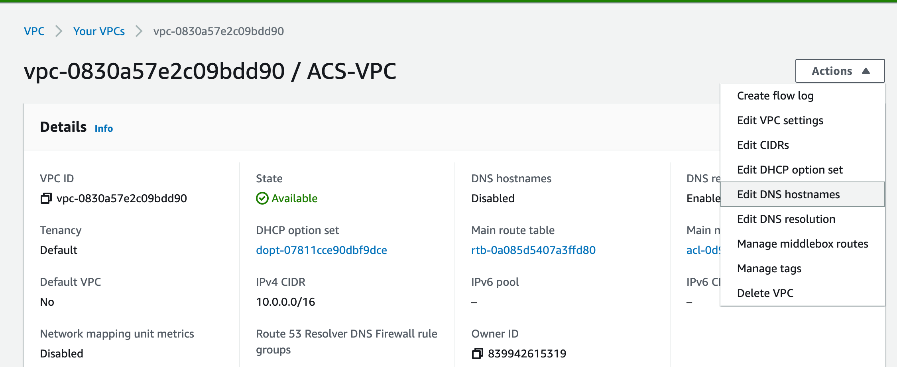
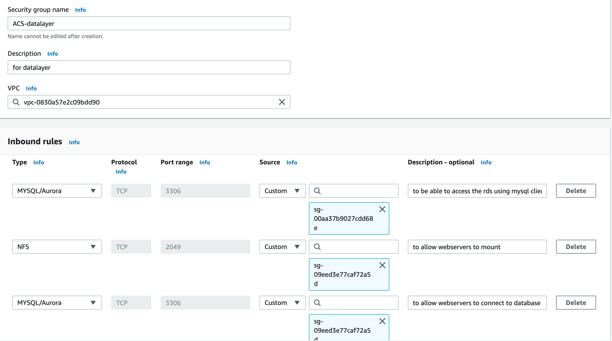
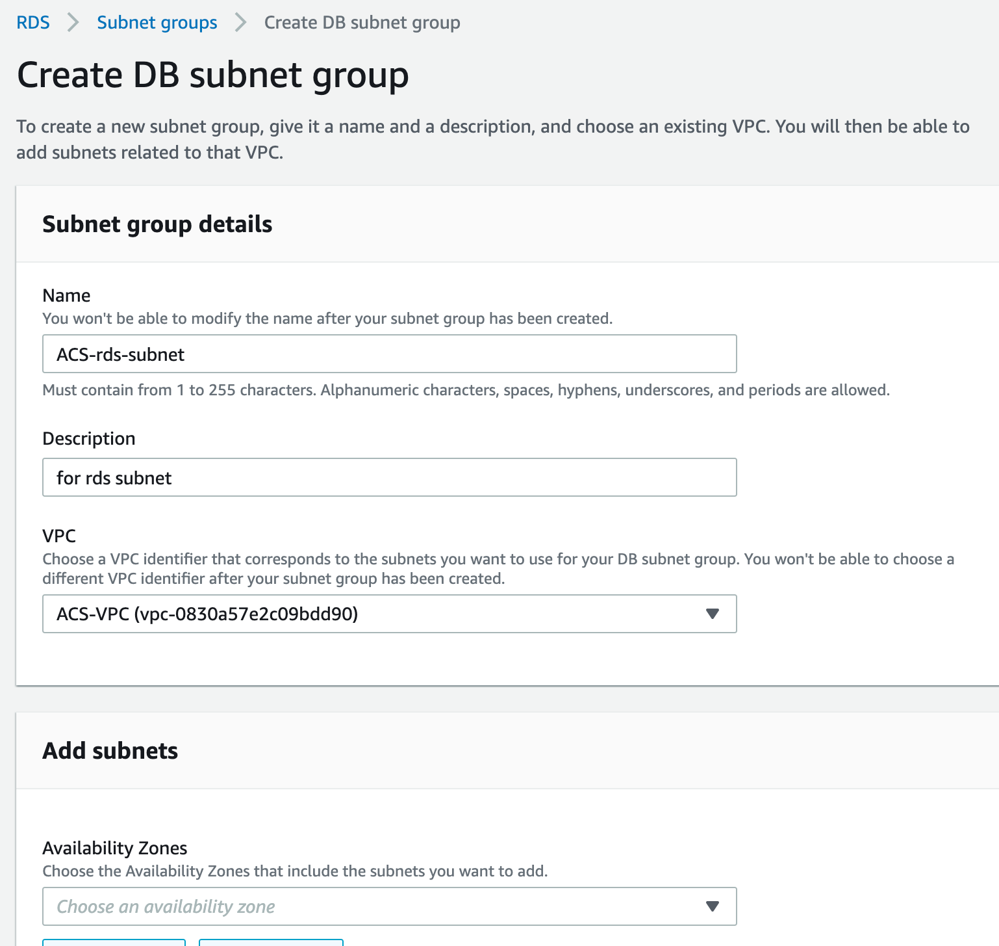
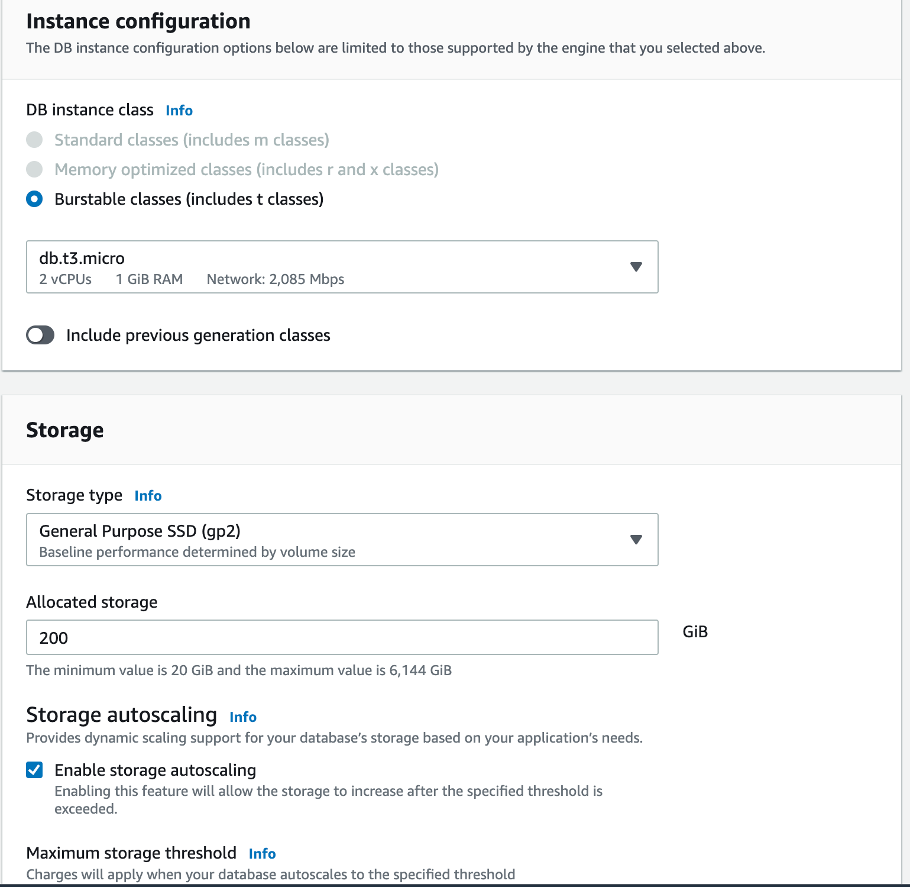
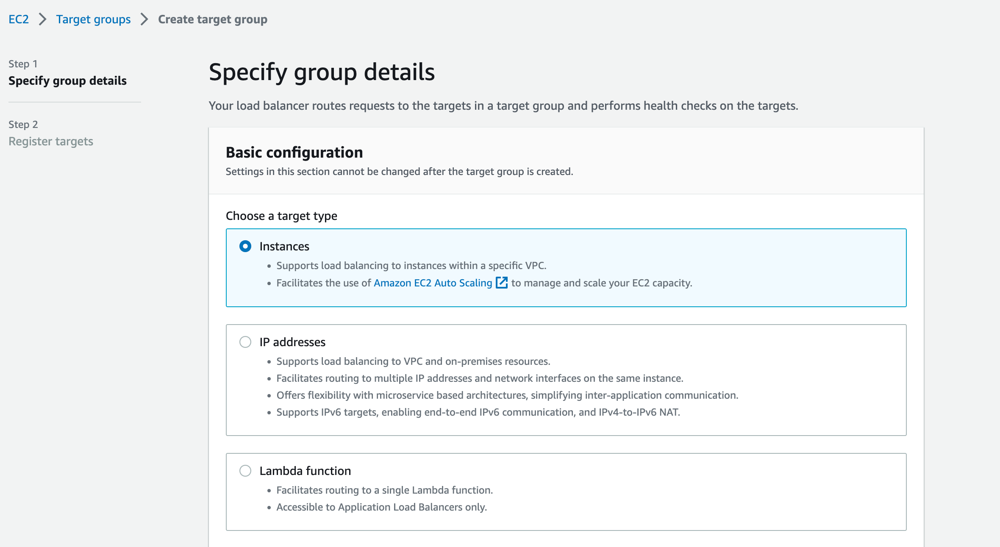
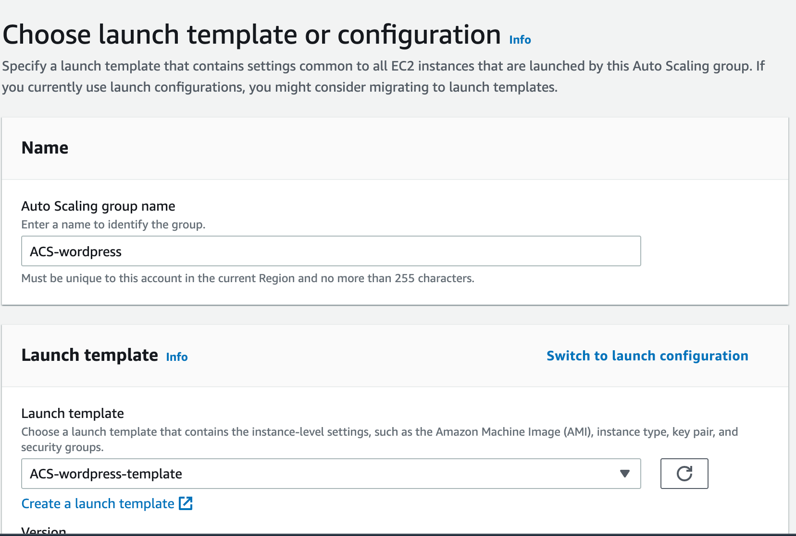

# AWS CLOUD SOLUTION FOR 2 COMPANY WEBSITES USING A REVERSE PROXY TECHNOLOGY

This project demonstrates how a secure infrastructure inside AWS VPC (Virtual Private Cloud) network is built for a particular company, who uses WordPress CMS for its main business website, and a Tooling Website for their DevOps team. As part of the company’s desire for improved security and performance, a decision has been made to use a reverse proxy technology from NGINX to achieve this. The infrastructure will look like following diagram:


### SET UP A VIRTUAL PRIVATE NETWORK (VPC)

- Created a VPC and enabled the DNS hostnames. as seen in the images below.





- Created Internet gateway and attached it to the VPC.


- Created subnet for public and private, in each availablity zone respectively, thus for the public subnet, 2 subnets were created in availability zone A and B respectively and for the private subnet 4 subnets were created with respect to the diagram we are working with, this implies that 2 subnets were created each in availability zone A and B which makes it a  total of 4 private subnets created.


- Created a route table, private and public each then associate the subnet to the route table. The 2 public subnets were associated to the public route table likewise the 4 private subnets were associated to the private route table.


- Edited a route in public route table, and associated it with the Internet Gateway. (This is what allows a public subnet to be accessible from the Internet).


- Create an Elastic IP address that will be used by the NAT-Gateway.


- Created the Nat-Gateway, created in a public subnet and attached the Elastic IP created.


- From the route table the Private route table in the edit routes was edited, to set target to the Nat-Gateway created earlier as seen below.


Created Security Group for:

- External Application Load Balancer: To make ALB reachable from the internet.


- Bastion Servers: Access to the Bastion servers should be allowed only from workstations that need to SSH into the bastion servers. Hence, I used my workstation public IP address.

 

- Nginx (Reverse Proxy Server): Access was only granted from the external application load balancer and ssh from bastion server.

 

- Internal Application Load Balancer: Configured to be accessable by Nginx (Reverse Proxy Server)

 

- Webserver: Only allowed traffic from Internal Load Balancer and SSH from Bastion only.

 

 - Datalayer: Configured to allow trafic from Bastion (Mysql), Webserver (NFS and Mysql).

  

- Created AWS certificate, ensure domain purchased is transferred to AWS Route 53. The major reason for creating a certificate first is mainly because when creating an application load balancer there is need to select a certificate because all the instances behind a load balancer listens to traffic from port 443. Then we create record on Route 53 after creating the certificate. This are certificates we attach to all the load balancers


- Created Amazon EFS: Added mount target to the filesystem i.e specifying the subnet. Wherever the mount target is specified the Amazon EFS becomes available in that subnet as such we specify it in private subnet 1 & 2 so that all the resources in that subnet will have the ability to mount to the file system. Then for the security group setting the datalayer security group was selected as seen below.


- Created 2 access point 1 for wordpress the other for tooling (This is done so that we won't mount both servers to a single access point, if mounted to a single access point the file will tend to overwrite one another and that can lead to a catastrophy in the infastructure). Access point is what we will specify to the webservers to mount with.


- Setup Amazon RDS, before setting up the RDS Created a KMS key from Key Management Service (KMS) to be used to encrypt the database instance, and subnet group








### Auto Scaling Group

To create auto scaling group there are two requirements needed which are; Launch Templates and Load Balancers. The Launch Templates requires AMI and Userdata while the Load balancer requires target goup. 

Before creating the auto scaling group, the following steps were taken.

- Created 3 Instances (Redhat) with security group (All traffic - anywhere) named Bastion, Nginx and Webserver.

The following installation were done on each instances

### Bastion ami installation
```
yum install -y https://dl.fedoraproject.org/pub/epel/epel-release-latest-8.noarch.rpm

yum install -y dnf-utils http://rpms.remirepo.net/enterprise/remi-release-8.rpm

yum install wget vim python3 telnet htop git mysql net-tools chrony -y

systemctl start chronyd

systemctl enable chronyd
```

Nginx ami installation 

```
yum install -y https://dl.fedoraproject.org/pub/epel/epel-release-latest-8.noarch.rpm

yum install -y dnf-utils http://rpms.remirepo.net/enterprise/remi-release-8.rpm

yum install wget vim python3 telnet htop git mysql net-tools chrony -y

systemctl start chronyd

systemctl enable chronyd
```
## configure selinux policies for the nginx servers
```
setsebool -P httpd_can_network_connect=1
setsebool -P httpd_can_network_connect_db=1
setsebool -P httpd_execmem=1
setsebool -P httpd_use_nfs 1
```
## this section will install amazon efs utils for mounting the target on the Elastic file system
```
git clone https://github.com/aws/efs-utils

cd efs-utils

yum install -y make

yum install -y rpm-build

make rpm 

yum install -y  ./build/amazon-efs-utils*rpm
```
## seting up self-signed certificate for the nginx instance
```
sudo mkdir /etc/ssl/private

sudo chmod 700 /etc/ssl/private

openssl req -x509 -nodes -days 365 -newkey rsa:2048 -keyout /etc/ssl/private/ACS.key -out /etc/ssl/certs/ACS.crt

sudo openssl dhparam -out /etc/ssl/certs/dhparam.pem 2048
```

### webserver ami installation 
```
yum install -y https://dl.fedoraproject.org/pub/epel/epel-release-latest-8.noarch.rpm

yum install -y dnf-utils http://rpms.remirepo.net/enterprise/remi-release-8.rpm

yum install wget vim python3 telnet htop git mysql net-tools chrony -y

systemctl start chronyd

systemctl enable chronyd
```
## configure selinux policies for the webservers
```
setsebool -P httpd_can_network_connect=1
setsebool -P httpd_can_network_connect_db=1
setsebool -P httpd_execmem=1
setsebool -P httpd_use_nfs 1
```
## this section will install amazon efs utils for mounting the target on the Elastic file system
```
git clone https://github.com/aws/efs-utils

cd efs-utils

yum install -y make

yum install -y rpm-build

make rpm 

yum install -y  ./build/amazon-efs-utils*rpm
```

## seting up self-signed certificate for the apache  webserver instance
```
yum install -y mod_ssl

openssl req -newkey rsa:2048 -nodes -keyout /etc/pki/tls/private/ACS.key -x509 -days 365 -out /etc/pki/tls/certs/ACS.crt

vi /etc/httpd/conf.d/ssl.conf
```

While generating the certificate. the common name has to be the private IPv4 dns of the instance (Webserver/Nginx). The load balancer does not validate the certicates but it needs to be installed. We use the certificate by specifying the path to the file ACS.crt and ACS.key in the nginx configuration.

verified that the ACS.crt and ACS.key file exist on the nginx server 


Unlike nginx were we had to specify directory inside the reverse.conf the ssl.conf for the webserver was edited to conform with the key and crt file we created.


- Created AMI for each of the instances. as seen below


- Target groups were created for Nginx, Worpress, and Tooling because they are all behind a load balancer. In these target groups, Auto-Scaling will launch an instance.





- Created Load Balancers (External Load Balancer - Internet facing). A load balancer needs at least 2 availabilty zones to work and placed in a public subnet.


- Created Load Balancer (Internal Load Balancer - Internal facing) placed in private subnet.


As a result of configuring the target to wordpress, all traffic that enters the load balancer falls into the wordpress target, so a rule was created to forward traffic to the tooling target.


- Created launch templates for Bastion, Nginx, Wordpress and Tooling.

for Bastion 


- Same settings was applied for nginx the difference made was the user data input, the AMI (ACS-nginx-ami), the security group (ACS-nginx-security group) and placed in public subnet.


- The reverse.conf file was updated by inputing the end point of the internal load balancer (DNS name) in the proxy_pass section of the file, so that when the userdata is cloning the repository, it will have the updated version of the conf file.


- Same settings was applied for wordpress the difference made was the user data input, the AMI (ACS-webserver-ami), the security group (ACS-webserver-security group) and it's placed in private subnet.

Wordpress user data

```
#!/bin/bash
mkdir /var/www/
sudo mount -t efs -o tls,accesspoint=fsap-0c8f22c6b9d1f8ccc fs-00062274a0d133886:/ /var/www/
yum install -y httpd 
systemctl start httpd
systemctl enable httpd
yum module reset php -y
yum module enable php:remi-7.4 -y
yum install -y php php-common php-mbstring php-opcache php-intl php-xml php-gd php-curl php-mysqlnd php-fpm php-json
systemctl start php-fpm
systemctl enable php-fpm
wget http://wordpress.org/latest.tar.gz
tar xzvf latest.tar.gz
rm -rf latest.tar.gz
cp wordpress/wp-config-sample.php wordpress/wp-config.php
mkdir /var/www/html/
cp -R /wordpress/* /var/www/html/
cd /var/www/html/
touch healthstatus
sed -i "s/localhost/acs-database.cfagfrpr0cv7.us-east-2.rds.amazonaws.com/g" wp-config.php 
sed -i "s/username_here/ACSadmin/g" wp-config.php 
sed -i "s/password_here/Olasunkanmi200/g" wp-config.php 
sed -i "s/database_name_here/wordpressdb/g" wp-config.php 
chcon -t httpd_sys_rw_content_t /var/www/html/ -R
systemctl restart httpd
```

- Updated the mount point in the user data above.


- Also placed the rds end point for wordpress in the user data by extracting it from


- The processes for wordpress was repeated for tooling. the user data for tooling can be seen below.

```
#!/bin/bash
mkdir /var/www/
sudo mount -t efs -o tls,accesspoint=fsap-0dbe71bcc95c3a0a9 fs-00062274a0d133886:/ /var/www/
yum install -y httpd 
systemctl start httpd
systemctl enable httpd
yum module reset php -y
yum module enable php:remi-7.4 -y
yum install -y php php-common php-mbstring php-opcache php-intl php-xml php-gd php-curl php-mysqlnd php-fpm php-json
systemctl start php-fpm
systemctl enable php-fpm
git clone https://github.com/Revelation69/tooling-1.git
mkdir /var/www/html
cp -R /tooling-1/html/*  /var/www/html/
cd /tooling-1
mysql -h acs-database.cdqpbjkethv0.us-east-1.rds.amazonaws.com -u ACSadmin -p toolingdb < tooling-db.sql
cd /var/www/html/
touch healthstatus
sed -i "s/$db = mysqli_connect('mysql.tooling.svc.cluster.local', 'admin', 'admin', 'tooling');/$db = mysqli_connect('acs-database.cfagfrpr0cv7.us-east-2.rds.amazonaws.com', 'ACSadmin', 'Olasunkanmi200', 'toolingdb');/g" functions.php
chcon -t httpd_sys_rw_content_t /var/www/html/ -R
systemctl restart httpd
```

- All launch template were created succesfully.


### Set up Auto Scaling Group

- Created Auto Scaling Group for Bastion


- Created Auto Scaling Group for Nginx

Same steps were followed the only difference is that nginx has a load balancer


Before i created an Autoscaling Group for wordpress and Tooling, i created a database for Tooling and Wordpress by sshing into the bastion server and cnnecting to RDS by copying the RDS endpoint as the host. after connecting i created the databases for tooling and wordpress. As seen in the image below.


- Then i created Autoscaling group for wordpress and tooling.




- Created records for wordpress and tooling in route53, this is to ensure that the main domain for the WordPress website can be reached, and the subdomain for Tooling website can also be reached using a browser.


- Verified that health check passes for the target groups


- Accessed the wordpress and tooling via browser


